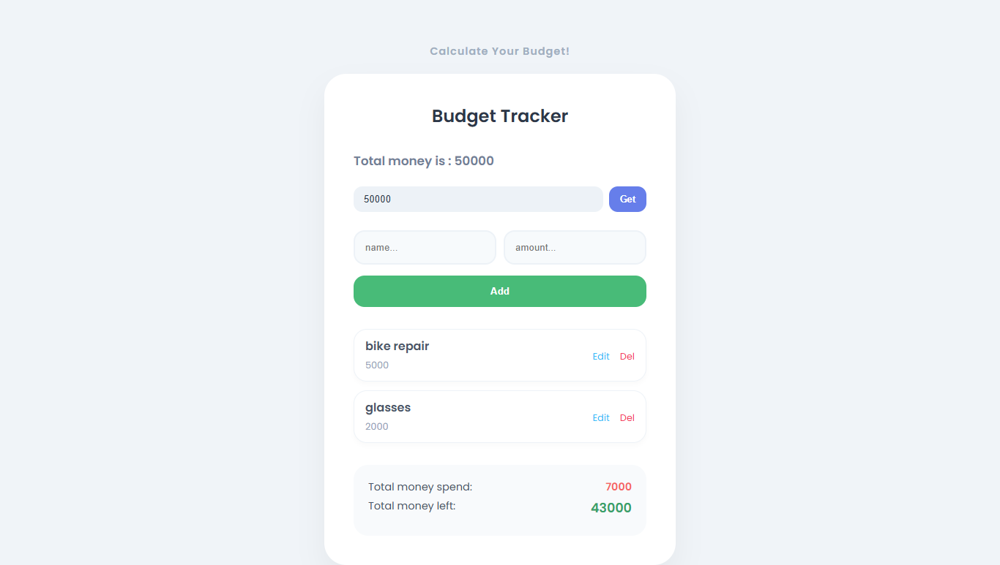

# Budget Tracker App

## Features
* **Modular Architecture:** Logic separated into `storage.js`, `utils.js`, and `budgetTracker.js` using ES6 Modules.
* **Smart Validation:** Prevents overspending by checking balance before adding or editing items.
* **Persistent Data:** Saves your budget and expense list to LocalStorage.
* **Full CRUD:** Add, Read, Update, and Delete expenses easily.

## Screenshot

## Tech Stack
* HTML / CSS
* JavaScript (ES6 Modules)
* LocalStorage API